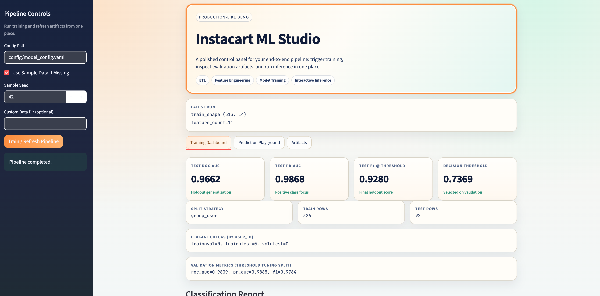

# Instacart End-to-End ML System
Author: Mutian He

A complete machine learning project covering ETL, feature engineering, model training, inference, and a Streamlit web app.

## Local Run (Recommended)
1. Install dependencies
```bash
pip install -r requirements.txt
```

2. Train the model (uses synthetic fallback data if raw files are missing)
```bash
python run_pipeline.py --use-sample-data-if-missing
```

3. Run CLI prediction
```bash
python predict.py
```

4. Launch the web app
```bash
streamlit run web_app.py
```
Open: `http://localhost:8511`

## Run Web App with Docker
```bash
docker build -t instacart-ml-web .
docker run --rm -p 8511:8511 instacart-ml-web
```
Open: `http://localhost:8511`

## Use Real Instacart Data (Optional)
Place the following files under `data/raw/`:
- `orders.csv`
- `order_products__prior.csv`
- `order_products__train.csv`
- `products.csv`
- `aisles.csv`
- `departments.csv`

```bash
python run_pipeline.py
```

## Evaluation Notes (Leakage-Aware)
- Uses `user_id` group split with `train/validation/test`
- Threshold is selected only on `validation`
- `test` is used only for final evaluation
- `artifacts/metrics.json` includes user-overlap checks (should be `0`)

## Web App Screenshot (Placeholder)
Put your screenshot here: `docs/images/web-app-screenshot.png`


